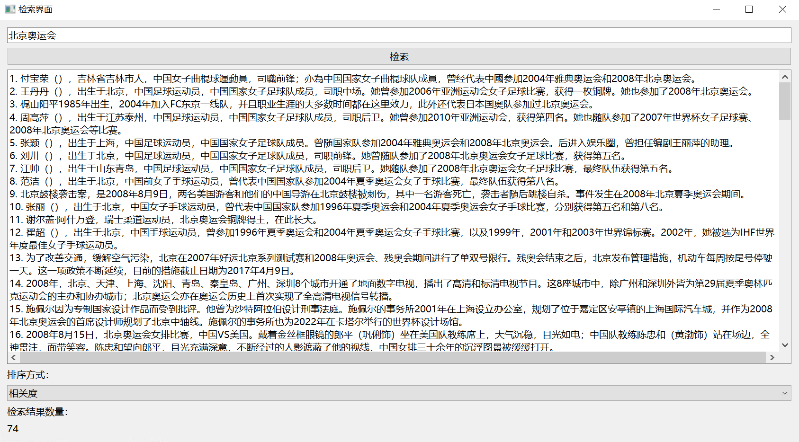

## 1. 项目介绍
做一个中文检索的项目，主要涉及到的技术有：  
1. 检索模型：采用了`mT5`模型，具体的实现可以参考[mT5](
## 2. 实验环境
我使用了miracl-zh-corpus-22-12数据集作为实验数据集[miracl/miracl-corpus](https://huggingface.co/datasets/Cohere/miracl-zh-corpus-22-12)
## 3. 项目结构
```
├── README.md
├── miracl-zh-corpus-22-12
│   ├── data
│   │   ├── README.md
│   │   ├── train-00000-of-00034.parquet
│   │   ├── train-00001-of-00034.parquet
│   │   ├── ...
│   │   ├── train-00033-of-00034.parquet
│   ├── doc_id2file_index.json
│   ├── miracle-zh-reverse-index.json
│   ├── miracle-zh-vocab.json
├──bool_retrieve_rerank.py
├──create_reverse_index.py
├──rerank_model.py
```
## 4. 项目运行
### 4.0 数据集下载
```shell
# 安装git lfs
sudo apt-get install git-lfs
# 下载数据集
git lfs clone https://huggingface.co/datasets/Cohere/miracl-zh-corpus-22-12
```
### 4.1 创建倒排索引
当我们需要快速查找文档中的特定单词时，倒排索引是一种非常有用的数据结构。倒排索引是一个映射，将每个单词映射到包含该单词的文档列表。
我们使用了scacy的中文分词库，具体版本是[zh-core-web-sm-3.7.0](https://github.com/explosion/spacy-models/releases/download/zh_core_web_sm-3.7.0/zh_core_web_sm-3.7.0-py3-none-any.whl)，具体的实现可以参考[Available trained pipelines for Chinese](https://spacy.io/models/zh)
```shell
python -m spacy download zh_core_web_sm
```
```shell
python create_reverse_index.py
```
### 4.2 重排序模型
使用[nboost/pt-bert-base-uncased-msmarco](https://huggingface.co/nboost/pt-bert-base-uncased-msmarco)，具体的实现可以参考[rerank_model.py](rerank_model.py)
```shell
git lfs clone https://huggingface.co/nboost/pt-bert-base-uncased-msmarco
```

### 4.3 布尔检索和重排序实现
使用qt5做一个简单的界面,具体的实现可以参考[bool_retrieve_rerank.py](bool_retrieve_rerank.py)
```shell
python bool_retrieve_rerank.py
```
## 5. 项目效果


